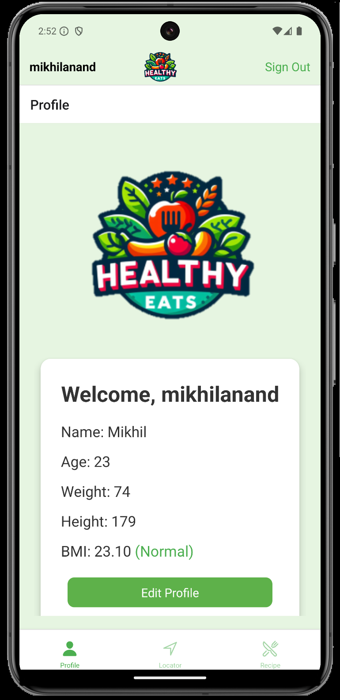
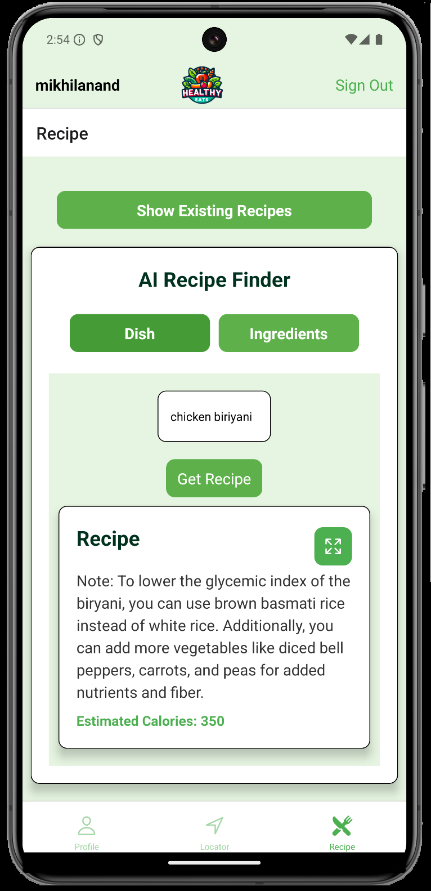
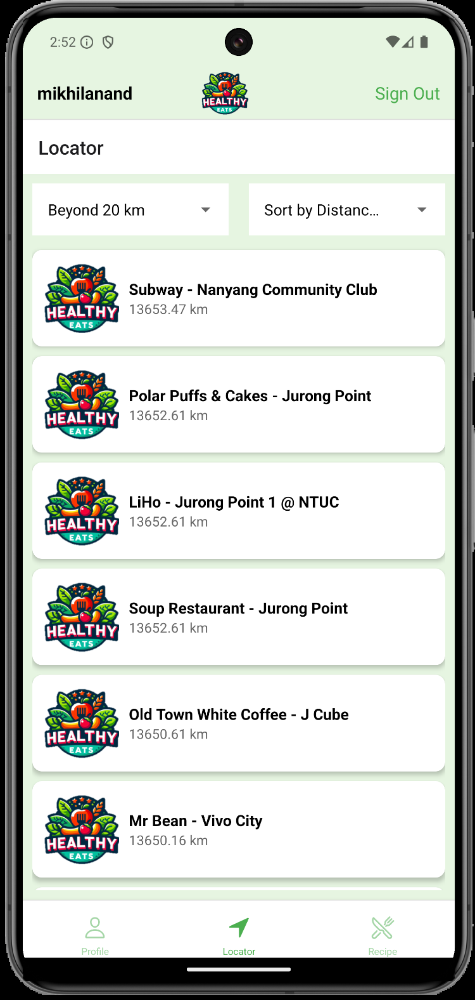

# Healthy Eats by FitTech Titans 
HealhtyEats is a mobile application designed to tackle diabetes in Singapore. It serves as a personalised companion for users to take control of their health. The application includes functionalities to search for healthy recipes using AI, find healthier choice ingredients for those recipes and locate nearby healthy eateries curated by HPB.

## Table of Contents

- [Features](#features)
- [Prerequisites](#prerequisites)
- [Installation](#installation)
- [Configuration](#configuration)
- [Usage](#usage)
- [Project Structure](#project-structure)
- [Screenshots](#screenshots)
- [Contributing](#contributing)
- [License](#license)

## Features

- **Recipe Finder**: Search for healthier recipes by dish name or ingredients using AI
- **Rating System**: Rate recipes and view average user ratings.
- **Locator**: Locate nearby healthy restaurants curated by HPB.
- **Profile Management**: Manage user profile, inclusive of BMI calculator.
- **Authentication**: Secure user authentication using AWS Amplify.

## Prerequisites

- Node.js and npm installed
- Expo CLI installed
- AWS account with Amplify setup
- Amplify CLI installed and configured

## Installation

1. Clone the repository:

    ```sh
    git clone https://github.com/Sasmik23/HealthyEats.git
    cd HealthyEats
    ```

2. Install dependencies:

    ```sh
    npm install
    ```

3. Install Expo CLI if you haven't already:

    ```sh
    npm install -g expo-cli
    ```

4. Initialize Amplify in your project:

    ```sh
    aws configure
    npx ampx sandbox
    ```

## Configuration

1. Configure AWS Amplify:

    ```javascript
    // In your project root, create or update amplify_exports.js
    import { Amplify } from 'aws-amplify';
    import awsconfig from './aws-exports';
    Amplify.configure(awsconfig);
    ```

2. Add environment variables for OpenAI API:

    ```sh
    echo "OPENAI_API_KEY=your_openai_api_key" > .env
    ```

## Usage

1. Start the application:

    ```sh
    expo start
    ```

2. Run on your preferred device or emulator.

## Project Structure
```
├── amplify #backend code
├── assets # Images and other assets
├── components # Reusable React components
│ ├── DishList.tsx
│ ├── RecipeFinder.tsx
│ ├── RecipeInput.tsx
├── screens # Screen components for navigation
│ ├── LocatorScreen.tsx
│ ├── ProfileScreen.tsx
│ ├── RecipeScreen.tsx
├── styles # Stylesheets
│ ├── styles.ts
├── amplify_exports.js # AWS Amplify configuration
├── App.tsx # Main app component
└── package.json # Project metadata and dependencies
```


## Screenshots

  

## Contributing

1. Fork the repository.
2. Create a new branch (`git checkout -b feature-branch`).
3. Make your changes.
4. Commit your changes (`git commit -am 'Add new feature'`).
5. Push to the branch (`git push origin feature-branch`).
6. Create a new Pull Request.

